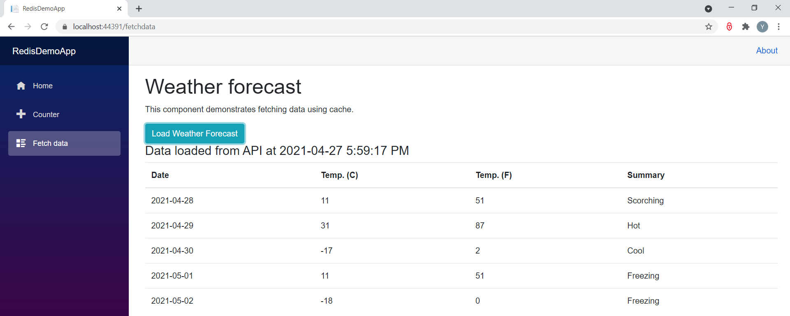
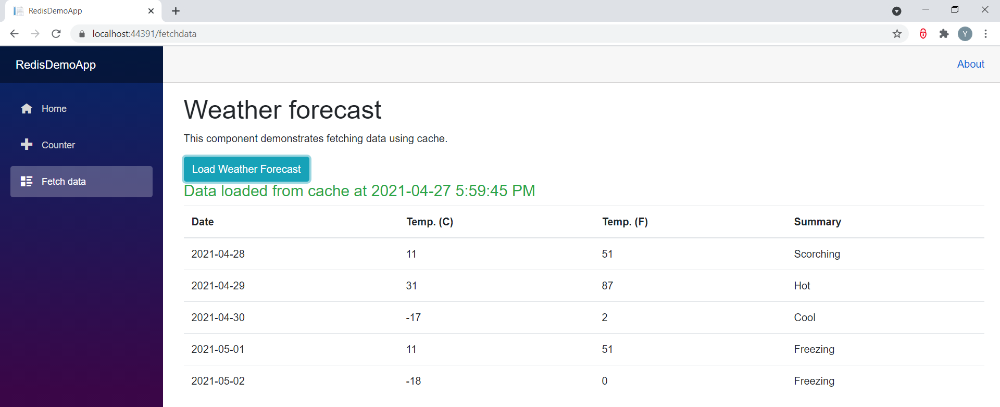
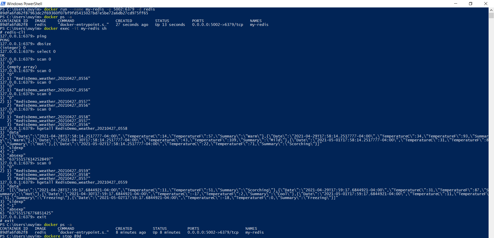

# A Blazor Server App for demonstrating how to use Redis cache running inside Docker container

<h3>Data retrieved from database(API) if it is not stored in Redis cache</h3>

<h3>Data retrieved from Redis cache if it is there</h3>

<h3>Power Shell commands for using Redis in Docker</h3>

